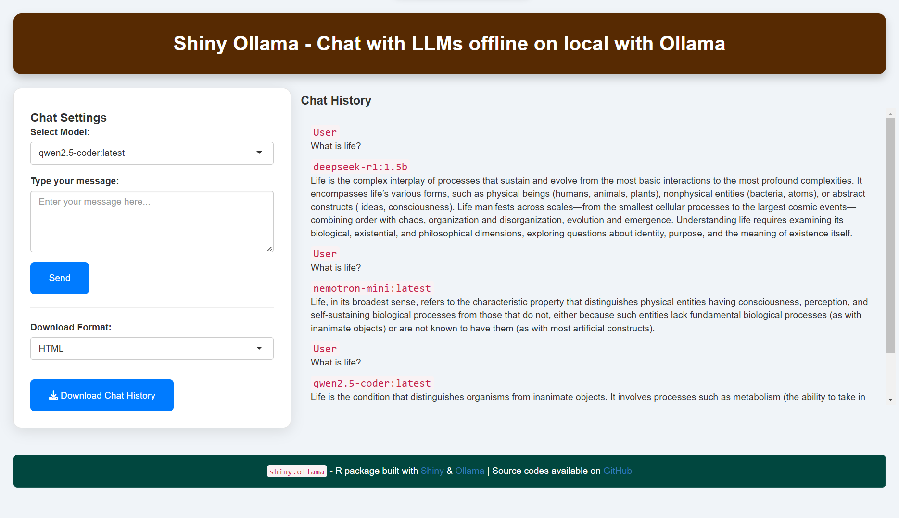

# `shiny.ollama` 

[](https://cran.r-project.org/package=shiny.ollama)
[](https://github.com/ineelhere/shiny.ollama)

**R Shiny Interface for Chatting with LLMs Offline via Ollama**

*Experience seamless, private, and offline AI conversations right on your machine! `shiny.ollama` provides a user-friendly R Shiny interface to interact with LLMs locally, powered by [Ollama](https://ollama.com).*  

[](https://www.indraneelchakraborty.com/shiny.ollama/)
[](https://hits.sh/github.com/ineelhere/shiny.ollama/)
[](https://opensource.org/license/apache-2-0/)
[](https://CRAN.R-project.org/package=shiny.ollama)




## ⚠️ Disclaimer  
**Important:** `shiny.ollama` requires Ollama to be installed on your system. Without it, this package will not function. Follow the [Installation Guide](#-how-to-install-ollama) below to set up Ollama first.  

##  Installation  
### From CRAN (Recommended)
```r
install.packages("shiny.ollama")
```

### From GitHub (Latest Development Version)
```r
# Install devtools if not already installed
install.packages("devtools")

devtools::install_github("ineelhere/shiny.ollama")
```

##  Features  
-  **Fully Offline**: No internet required – complete privacy
-  **Model Selection**: Easily choose from available LLM models
-  **Message Input**: Engage in conversations with AI
-  **Save & Download Chats**: Export your chat history
-  **User-Friendly Interface**: Powered by R Shiny

##  Quick Start  
Launch the Shiny app in R with:
```r
library(shiny.ollama)

# Start the application
shiny.ollama::run_app()
```

##  How to Install Ollama  
To use this package, install Ollama first:  

1.  Download Ollama from [here](https://ollama.com) (Mac, Windows, Linux supported).
2.  Install it by following the provided instructions.
3.  Verify your installation:
   ```sh
   ollama --version
   ```
   If successful, the version number will be displayed.

4.  Pull a model (e.g., [deepseek-r1](https://ollama.com/library/deepseek-r1)) to get started.

## License and Declaration
This R package is an independent, passion-driven open source initiative, released under the **`Apache License 2.0`**. It is not affiliated with, owned by, funded by, or influenced by any external organization. The project is dedicated to fostering a community of developers who share a love for coding and collaborative innovation.

 Contributions, feedback, and feature requests are always welcome! 
 
 Stay tuned for more updates. 🚀
